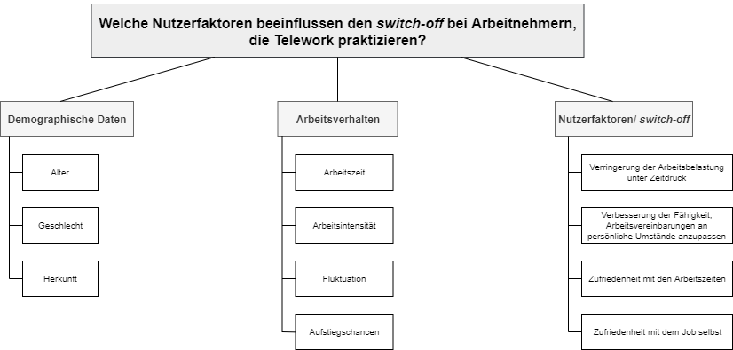
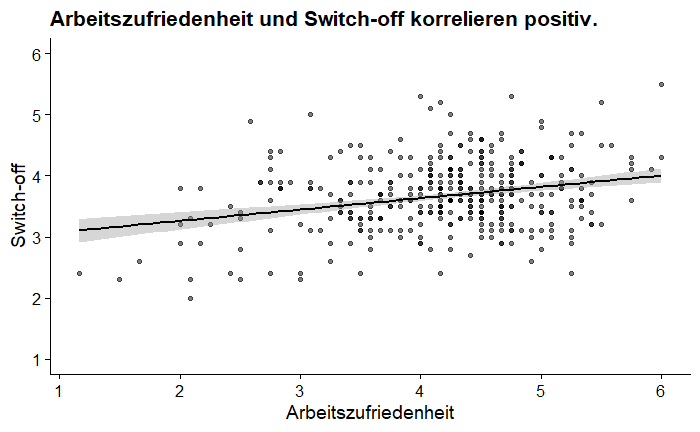
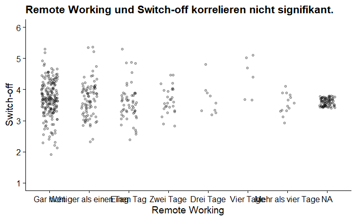
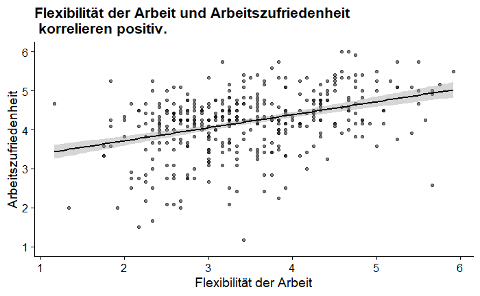
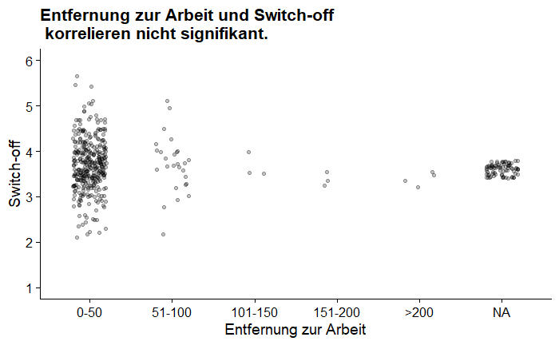
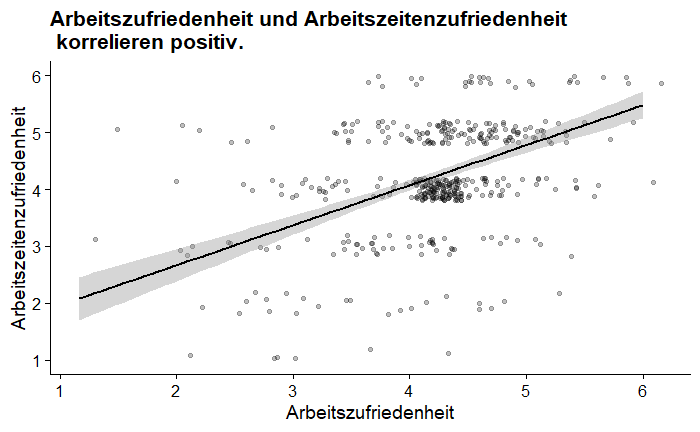
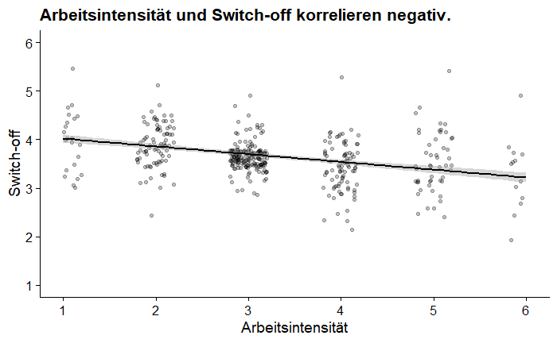
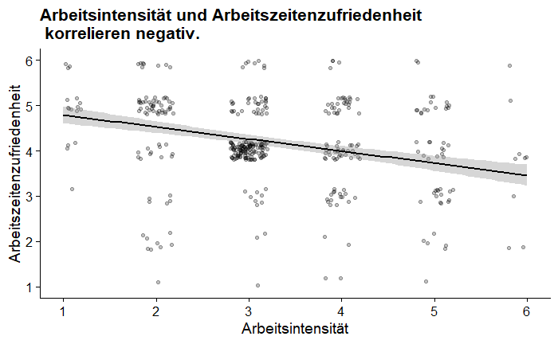

 
```{r setup, echo=FALSE, message=FALSE, warning=FALSE, cache=FALSE, paged.print=TRUE}
## Global options
library(knitr)
options(max.print="75")
opts_chunk$set(echo=TRUE,
	             cache=FALSE,
               prompt=FALSE,
               tidy=TRUE,
               comment=NA,
               message=FALSE,
               warning=FALSE,
               fig.width = 6,
               fig.height = 3.5,
               fig.retina = 2
               )
opts_knit$set(width=100)

# Load required libraries
library(rmdformats)
library(rmdtemplates)
library(tidyverse)
library(DT)
# add libraries here
pkgs <- c("knitr", "tidyverse", "rmdformats", "kableExtra", "scales", "psych", "rmdtemplates", "DT")
rmdtemplates::write_bib(pkgs)
```


# Theoretischer Hintergrund {-}

> Was bedeutet **Work-Life-Balance**?  
>
> "Ein von dem Individuum als ausgewogen empfundenes Gleichgewicht zwischen Berufs- und Privatleben."  
>


<br>
<br>

Basis: Forschungspaper „Assessing the growth of remote working and its consequences for effort, well-being and work-life balance“ von Alan Felstead and Golo Henseke  

<br>

Forschungsziel des Papers zweigeteilt:  

* Abtrennung der Arbeit von traditionellen Arbeitsplätzen  
* Konsequenzen von Telework auf:  
    1. Arbeitsaufwand  
    2. berufsbezogenes Wohlbefinden  
    3. Work-Life-Balance
    
    
# Motivation {-}

Digitalisierung ermöglicht technologische Veränderungen, erleichtern Prozesse und ist in Konzernen und Dienstleistungsunternehmen verbreitet. Telework geht mit der Digitalisierung einher und wird durch diese vorangetrieben. Telework ist derzeit sehr verbreitet und wird sich immer weiter etablieren.  

Unsere Forschung fokussiert die Work-Life-Balance, die wiederum von Telework positiv beeinflusst werden kann.  

Telework bietet verschiedene Optionen:

* abhängig von dem, was Chef und Job erlauben
* Wie häufig arbeitet man wo?
* Wie kann man sich durch Remote-Working die Arbeitszeit einteilt/einteilen kann?
* Inwiefern wirkt sich Telework konkret auf die Work-Life-Balance aus?

<br>

Die Work-Life-Balance wird durch Aspekte des Remote-Working beeinflusst, die wiederum Einfluss auf das Wohlbefinden und die Koordination der Freizeit nehmen:

* Arbeitszeit
* Arbeitsintensität
* Arbeitszufriedenheit
* Aufstiegschancen


# Forschungsfrage {-}

> Welche Nutzerfaktoren beeinflussen den **Switch-off** bei Arbeitnehmern, die Telework praktizieren?

<br>

im Paper beschriebene Auswirkungen von Telework:

* Arbeitsdruck greift auf Privatleben über
* Work-Home-Spill-Over wird verstärkt
* verringert die Arbeitsbelastung
* macht leistungsfähiger und zufriedener als Arbeit im Büro
* organisatorisches Engagement steigt
* Zufriedenheit mit Arbeitszeit und Job steigt

<br>

Die Untersuchung beschränkte sich auf im Paper beschriebene Auswirkungen von Telework, die sich mit dem Switch-off beschäftigen. Manche herausgearbeiteten Aspekte sind widersprüchlich oder unvollständig, weshalb eine eigene Forschungsfrage formuliert wurde, deren Beantwortung im Optimalfall eindeutigere Ergebnisse liefert.

<br>

Die Faktoren, die uns im Team gemeinsam interessieren, sind die sozialen Interaktionen der Probanden, wie flexibel ihre Arbeitsbedingungen sind sowie ihre allgemeine Arbeitszufriedenheit.


# Faktorenraum {-}
Zur Klärung der Frage, welche Nutzerfaktoren den **Switch-off** bei Arbeitnehmern beeinflussen, die Telework praktizieren, werden verschiedene Aspekte untersucht:  

Zu Beginn werden demographische Daten wie das Alter, das Geschlecht und die Herkunft erfragt. Um ein realistisches Bild vom Arbeitsverhalten der Probanden zu erhalten, werden Daten zu den Arbeitszeiten, der Intensität der Arbeit, der Fluktuation der Arbeitnehmer in einem Unternehmen sowie zu Aufstiegschancen erhoben. Anschließend wird abgefragt, wie Arbeitnehmer sich mit ihrer Arbeit fühlen und dementsprechend den **Switch-off** erleben. Wie schwer die Belastung durch Arbeit unter Zeitdruck wahrgenommen wird, wie viel besser Arbeitsvereinbarungen an persönliche Umstände anpassbar werden, wie zufrieden Arbeitnehmer mit ihren Arbeitszeiten und mit ihrem Job sind, sind hier die Hauptaspekte.


---

  


# Unterschiedshypothesen {-}

Hypothese 1  

* Hypothese: Mitarbeiter, die mit ihren Arbeitszeiten zufrieden sind, weisen einen besseren Switch-off auf.
* Verfahren: one-way ANOVA
* UV: Arbeitszeitenzufriedenheit
* AV: Switch-off
* H0: Mitarbeiter, die zufrieden mit ihren Arbeitszeiten sind und die, die unzufrieden mit ihren Arbeitszeiten sind, unterscheiden sich nicht im Switch-off.
* H1: Mitarbeiter, die zufrieden mit ihren Arbeitszeiten sind und die, die unzufrieden mit ihren Arbeitszeiten sind, unterscheiden sich im Switch-off.

<br>

Hypothese 2  

* Hypothese: Mitarbeiter mit geringerer Arbeitszeit (bis zu 29 Std. pro Woche) und geringerer Arbeitsintensität (keine Überstunden) weisen einen besseren Switch-off auf.
* Verfahren: two-way ANOVA
* UV: Arbeitszeit, Arbeitsintensität
* AV: Switch-off
* H0: Es gibt keinen Unterschied beim Switch-off in Bezug auf die Arbeitszeit.
* H1: Es gibt einen Unterschied beim Switch-off in Bezug auf die Arbeitszeit.

<br>

Hypothese 3  

* Hypothese: Mitarbeiter, die länger (über den Mediansplit der Arbeitsjahre) in der aktuellen Jobposition beschäftigt sind, weisen einen besseren Switch-off auf.
* Verfahren: T-Test
* H0: Die Beschäftigungsdauer der Mitarbeiter in der aktuellen Jobposition hat keinen Einfluss auf den Switch-off.
* H1: Die Beschäftigungsdauer der Mitarbeiter in der aktuellen Jobposition hat einen Einfluss auf den Switch-off.

<br>

Hypothese 4  

* Hypothese: Mitarbeiter, die den Großteil der Woche (3 Tage oder mehr) nicht am Arbeitsplatz arbeiten, weisen einen schlechteren Switch-off auf.
* Verfahren: T-Test
* H0: Der Switch-off hängt nicht von der Anzahl der Tage in der Woche ab, die Mitarbeiter nicht am Arbeitsplatz verbringen.
* H1: Der Switch-off hängt von der Anzahl der Tage in der Woche ab, die Mitarbeiter nicht am Arbeitsplatz verbringen.

<br>

Hypothese 5:  

* Hypothese: Mitarbeiter, die flexibel in ihrem Job sind, weisen einen besseren Switch-off und eine höhere Arbeitszufriedenheit auf.
* Verfahren: one-way MANOVA
* UV: Flexibilität
* AV: Switch-off, Arbeitszufriedenheit
* H0: Es gibt keinen Unterschied beim Switch-off und der Arbeitszufriedenheit in Bezug auf die Flexibilität im Job.
* H1: Es gibt einen Unterschied beim Switch-off und der Arbeitszufriedenheit in Bezug auf die Flexibilität im Job.


# Zusammenhangshypothesen {-}

Hypothese 1  

* Je höher die  Arbeitszufriedenheit, desto einfacher fällt der Switch-off.
* H1: Die Arbeitszufriedenheit und der Switch-off korrelieren positiv.
* H0: Die Arbeitszufriedenheit und der Switch-off korrelieren nicht.

<br>

Hypothese 2  

* Je höher die Position bei der Arbeit, desto schwieriger fällt der Switch-off.
* H1: Die Position der Arbeit korreliert mit dem Switch-off negativ.
* H0: Die POsition der Arbeit und der Switch-off korrelieren nicht.

<br>

Hypothese 3  

* Je mehr Remote Working betrieben wird, desto schwieriger fällt der Switch-off.
* H1: Remote Working und Switch-off korrelieren negativ.
* H0: Remote Working und Switch-off korrelieren nicht.

<br>

Hypothese 4  

* Je flexibler die Arbeit eingeteilt werden kann, desto höher ist die Arbeitszufriedenheit.
* H1: Die Flexibilität der Arbeit und die Arbeitszufriedenheit korrelieren positiv.
* H0: Die Flexibilität der Arbeit und die Arbeitszufriedenheit korrelieren nicht.

<br>

Hypothese 5  

* Je höher die Entfernung zur Arbeit, desto einfacher fällt der Switch-off.
* H1: Die Entfernung zur Arbeit und der Switch-off korrelieren positiv.
* H0: Die Entfernung zur Arbeit und der Switch-off korrelieren nicht.

# Methodik {-}


# Stichprobenbeschreibung {-}

# Ergebnisse {-}

### Unterschiede {-}

<br>

#### Hypothese 1: {-}

Mitarbeiter, die mit ihren Arbeitszeiten zufrieden sind, weisen einen besseren Switch-off auf.

Es gibt einen signifikanten Unterschied zwischen der Arbeitszufriedenheit und dem Switch off ($p<0.001$). Es gibt einen signifikanten Unterschied zwischen der Arbeitszeit und dem Switch off $F(2)=11.7$, $p<0.001$.

<br>

#### Hypothese 2 {-}
Mitarbeiter mit geringerer Arbeitszeit (bis zu 29 Std. pro Woche) und geringerer Arbeitsintensität (keine Überstunden) weisen einen besseren Switch-off auf.

Es gibt keinen signifikanten unterschied zwischen der Arbeitszeit und dem Switch off ($p>0.05$). Anders ist es bei der Arbeitintensität und dem Switch off, hier gibt es einen signifikanten Unterschied ($p<0.001$). 
Betrachtet man Arbeitszeit und -intensität in Bezug auf den Switch off, gibt es wiederum keinen signifikanten Unterschied ($p>0.05$).

<br>

#### Hypothese 3 {-}
Mitarbeiter, die länger (über den Mediansplit der Arbeitsjahre) in der aktuellen Jobposition beschäftigt sind, weisen einen besseren Switch-off auf.

Hypothese konnte nicht getestet werden.

<br>

#### Hypothese 4: {-}
Mitarbeiter, die den Großteil der Woche (3 Tage oder mehr) nicht am Arbeitsplatz arbeiten, weisen einen schlechteren Switch-off auf.

Hypothese konnte nicht getestet werden.

<br>

#### Hypothese 5: {-}
Mitarbeiter, die flexibel in ihrem Job sind, weisen einen besseren Switch-off und eine höhere Arbeitszufriedenheit auf.

Es gibt keinen signifikaten Unterschied zwischen der Arbeitsintensität und dem Switch Off ($p>0.05$).
Anders ist es bei der Arbeitsflexibilität und der Arbeitszufriedenheit. Hier besteht ein signifikanter Unterschied ($p<0.001$).


<br>
<br>

### Korrelation {-}

<br>

#### Hypothese 1: {-}
Je höher die  Arbeitszufriedenheit, desto einfacher fällt der Switch-off.

Es gibt einen positiven signifikanten Zusammenhang zwischen der Arbeitszufriedenheit und dem Switch-off ($\tau = 0.123$, $p<0.001$). Das bedeutet, dass mit steigender Arbeitszufriedenheit die Fähigkeit von der Arbeit abzuschalten steigt.



<br>

#### Hypothese 2: {-}
Je höher die Position bei der Arbeit, desto schwieriger fällt der Switch-off.

Es gibt keinen signifikanten Zusammenhang zwischen der Position der Arbeit und dem Switch-off ($\tau=-0.054$, $p>0.05$) oder dieser konnte hier nicht festgestellt werden.


<br>

#### Hypothese 3: {-}
Je mehr Remote Working betrieben wird, desto schwieriger fällt der Switch-off.

Es gibt keinen signifikanten Zusammenhang zwischen Remote Working und Switch-off ($\tau=-0.054$, $p>0.05$) oder dieser konnte hier nicht festgestellt werden.



<br>

#### Hypothese 4: {-}

Je flexibler die Arbeit eingeteilt werden kann, desto höher ist die Arbeitszufriedenheit.

Es gibt einen positiven signifikanten Zusammenhang zwischen der Flexibilität der Arbeit und der Arbeitszufriedenheit ($\tau=0.241$, $p<0.001$). Die Arbeitszufriedenheit steigt, wenn die Arbeit flexibel eingeteilt werden kann.




<br>

#### Hypothese 5: {-}
Je höher die Entfernung zur Arbeit, desto einfacher fällt der Switch-off.

Es gibt keinen signifikanten Zusammenhang zwischen der Entfernung zur Arbeit und dem Switch-off ($\tau=-0.034$, $p>0.05$) oder dieser konnte hier nicht festgestellt werden.



<br>

### weitere induktive Korrelationen {-}

<br>

#### induktive Korrelation 1 {-}
Es gibt einen positiven signifikantenm Zusammenhang zwischen der Arbeitszufriedenheit und der Arbeitszeitenzufriedenheit ($\tau=0.357$, $p<0.001$). Die allgemeine Arbeitszufriedenheit steigt mir der Zufriedenheit bezüglich den Arbeitszeiten.



<br>

#### induktive Korrelation 2 {-}
Es gibt einen signifikanten negativen Zusammenhang zwischen der Arbeitsintensität und dem Switch-off ($\tau=-0.33$, $p<0.001$). Je höher die Arbeitsintensität, desto schwieriger fällt der Switch-off.



<br>

#### induktive Korrelation 3 {-}

Es gibt einen signifikanten negativen Zusammenhang zwischen der Arbeitsintensität und der Arbeitszeitenzufriedenheit ($\tau=-0.281$, $p<0.001$). Je höher die Arbeitsintensität, desto geringer ist die Arbeitszeitenzufriedenheit.




# Diskussion {-}

# Methodenreflexion {-}

* Probleme beim Zugriff auf den Fragebogen
* Fragebogen für Mobilgeräte nicht optimiert
* Einteilung von Arbeitszeit und Häufigkeit bei Telework (Beantwortung optimieren)
* stärker auf den Job an sich eingehen
    * Ist Telework räumlich möglich?
    * Ist eine freie Einteilung der Arbeitszeit möglich?

# Ausblick {-}

* weitere Hypothesen prüfen
* Vorher-Nachher-Untersuchungen
* stärker auf den Job an sich eingehen
    * Ist Telework räumlich möglich?
    * Ist eine freie Einteilung der Arbeitszeit möglich?


# Literatur {-}

* Stor, Melanie (2010): Betriebliche Work-Life-Balance Maßnahmen: Auswirkung auf Unternehmen und die Zielgruppe Führungskräfte - Insbesondere weibliche Führungskräfte
* Abele, Claudia (2019): Interview – „Remote Work ist eine Win-WinSituation“ [https://www.personalwirtschaft.de/der-job-hr/artikel/interview-remotework.html]
* Felstead, Alan/Henseke, Golo (2017): Assessing the growth of remote working and its consequences for effort, well-being and work-life balance


